# Vocat

## Overview

Vocat is an app that allows users learn new vocabulary together with a cute cat. With the interaction with a pet, we seek to provide an incentive for people to learn more vocabulary.

## Functions and Pages

### Log In / Sign Up

We use Json Web Tokens to establish users' identities. Once a user successfully signs into their registered account, they're taken to the welcome page.
Log In			            |  Sign Up
:-------------------------:	|:-------------------------:
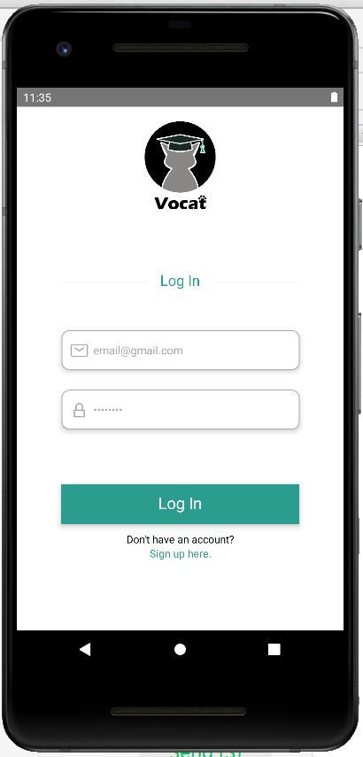|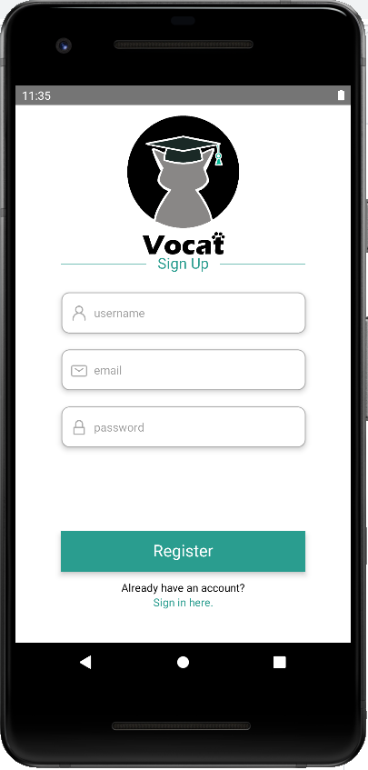

### Welcome

Tab navigation was implemented between our 5 main pages: welcome (home page), learning, reviewing, cat house, and user settings.
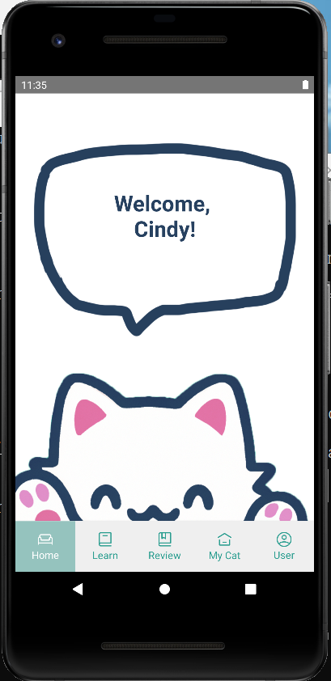

### Learning

When learning a word, the user is given with the word's part of speech, definition, and example of use in context. For every word learned, 5 vocat coins are rewarded.
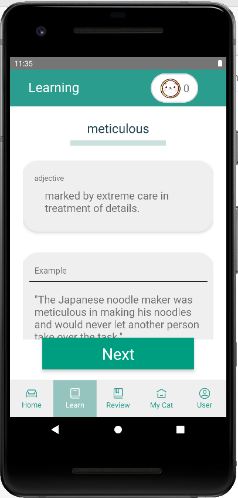|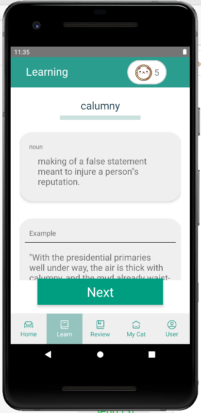|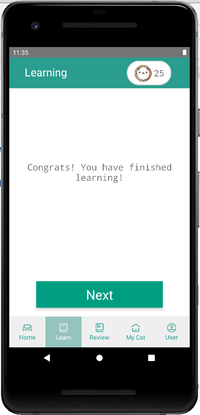

### Reviewing

Every word learned goes into the wordbank, and words in wordbank gets reviewed after a period of time. When reviewing, the definition and 4 answer choices are provided (1 correct and 3 randomly pulled words). If user answered correctly, 1 vocat coins is rewarded for each review word; else, if they got wrong, the word would be re-rendered at the end of today's review until correct.
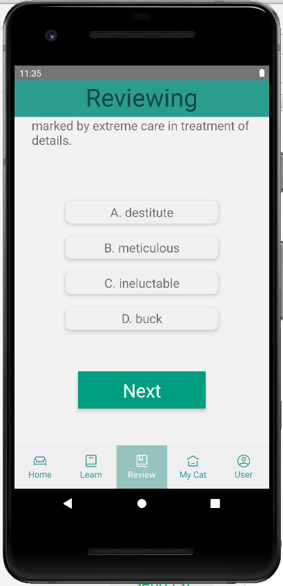|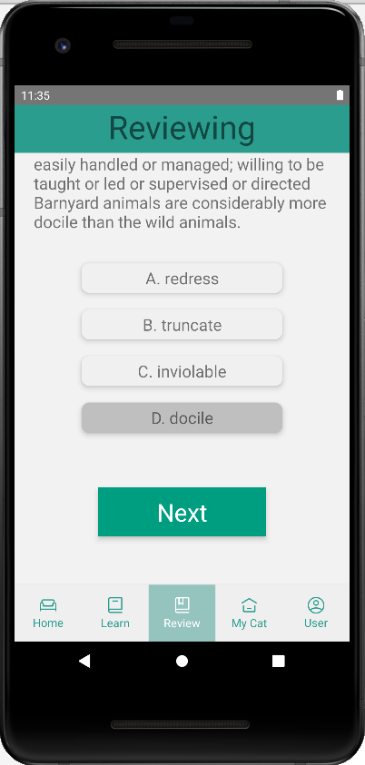|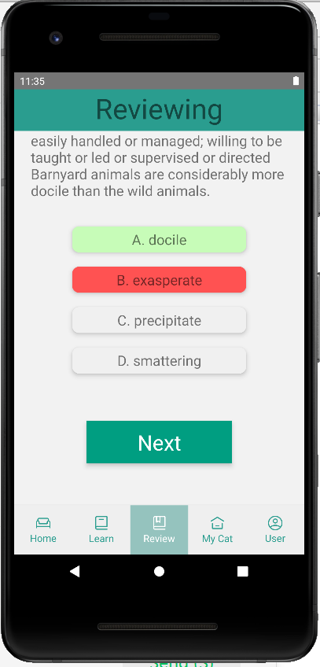|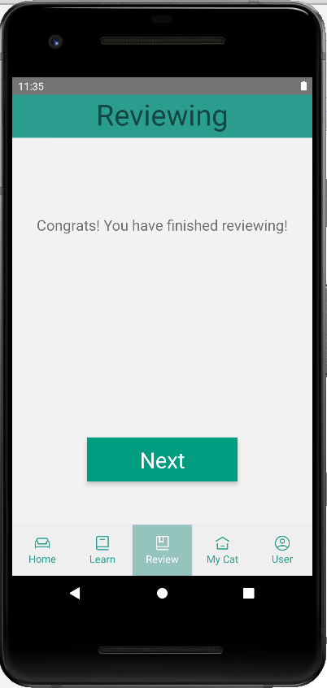

### Cat House

In the cat store, user can buy toys and food for their cat (each costs 20 vocat coins), and the use these items to interact with the cat.
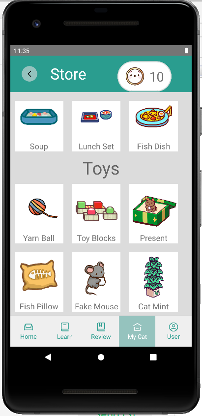|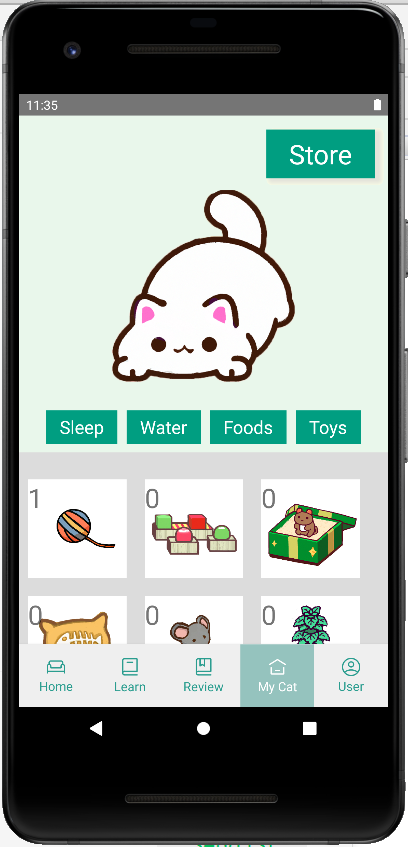|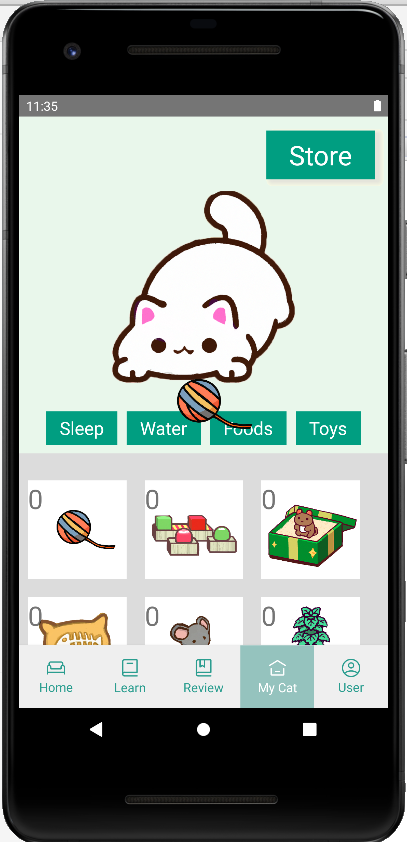|

### User

Number of words to learn each day can be customized in the progress page, where user's learning progress and plan are displayed.
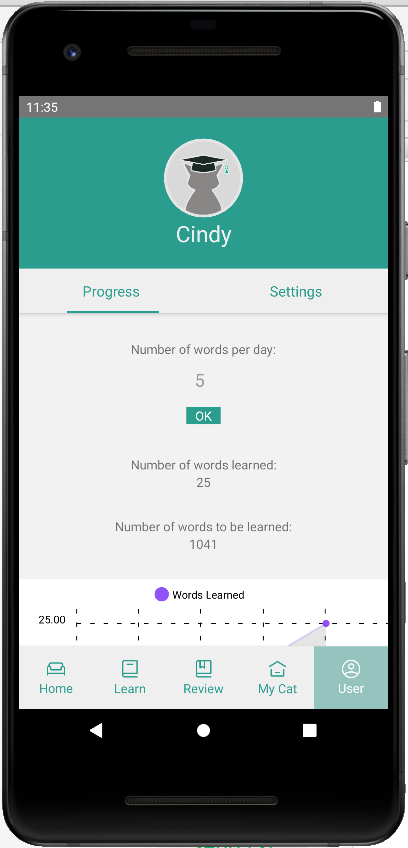

In the settings page, font size for the app display could be modified, "synchronize" updates user's local progress to our MongoDB database for back-up and retrieval from other devices. Finally, "sign out" takes us back to the log in page.
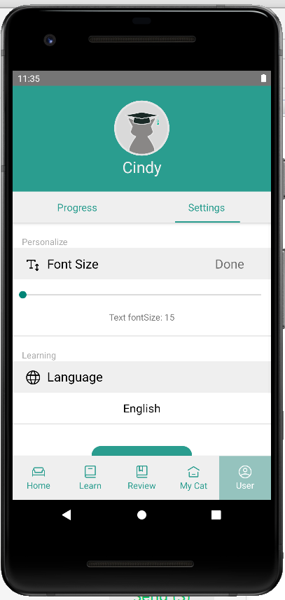|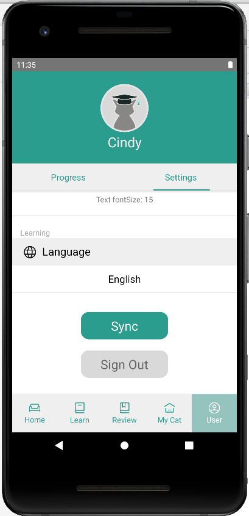

### Related Links and Documentations

Confluence Wiki:
https://vocat.atlassian.net/wiki/spaces/VOCAT/overview

Jira Board:
https://vocat.atlassian.net/jira/software/c/projects/TEAM/boards/2

UI Design on Figma:
https://www.figma.com/file/iTQrHFwMeXet7evJ1yVP09/Vocat
