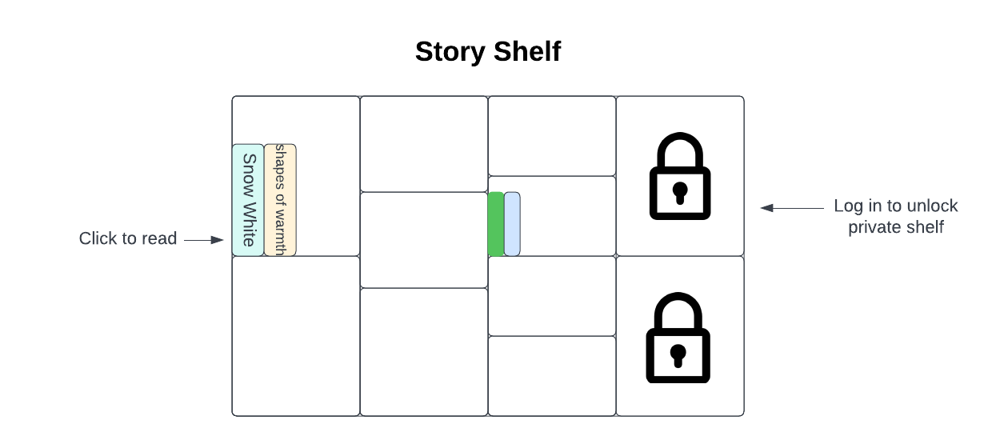
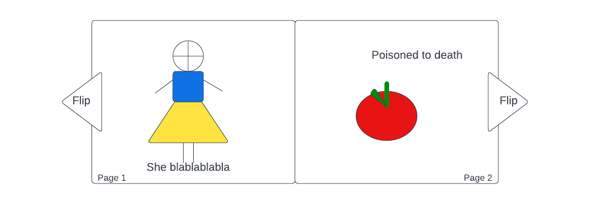
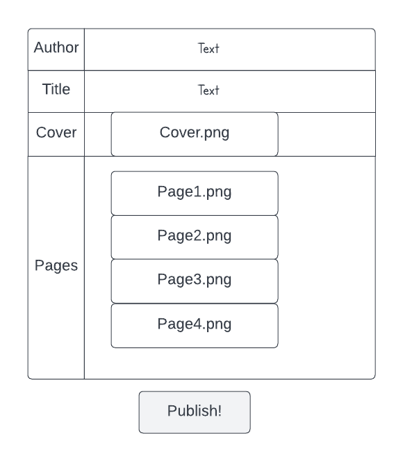
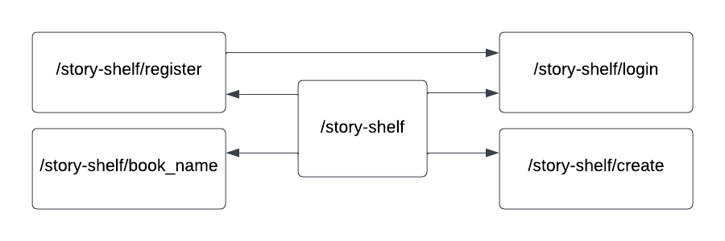

# Picture Shelf

## Overview

It can be space-consuming and wasteful to store picture books if they are read for few times. For painters who are interested in creating their own stories, printing and distribution are also complicated precesses. 

Story Shelf is a web app that will allow users to upload, share and read picture books. Users can register and login. Once they're logged in, they can create picture books. For every book that they created, they can add title, cover, and pages, etc. If a user is not logged in, they can only view the books on shelf.


## Data Model

The application will store Users and Books

* users have private shelves (which holds books they uploaded and therefore can edit)
* each book has title, cover, multiple content pages, and author (& uploader)

An Example User:

```javascript
{
  username: "delicatedoris",
  hash: // a password hash,
  books: // an array of references to Book documents
}
```

An Example Book:

```javascript
{
  user: // a reference to a User object
  author: "Andersen",
  title: "The Little Mermaid",
  cover: // location to an image
  pages: [
    { // location to an image },
    { // location to an image },
  ],
  dataCreated: // timestamp
}
```

## [Link to Commented First Draft Schema](db.mjs) 


## Wireframes

/story-shelf - index page for book shelf



/story-shelf/snow-white - cover for reading picture book
/story-shelf/snow-white/read?page=1 - page for reading picture book




/story-shelf/create - page for uploading new picture book



## Site map



## User Stories or Use Cases

1. as non-registered user, I can read public picture books
2. as non-registered user, I can register a new account with the site
3. as a user, I can log in to the site
4. as a user, I can upload a new picture book
5. as a user, I can view and edit all picture books I uploaded

## Research Topics

* (2 points) Perform client side form validation
* (4 points) take user image uploads and link images in mongodb
* (4 points) Using Google Books API

10 points total out of 10 required points


## [Link to Initial Main Project File](app.mjs) 


## Annotations / References Used

file upload:
https://cloudnweb.dev/2019/04/handle-file-upload-in-node-js/
https://www.sitepoint.com/forms-file-uploads-security-node-express/
<<<<<<< HEAD
=======

Google Books API
https://developers.google.com/books/docs/v1/
https://www.youtube.com/watch?v=LGcgChoD_qY
>>>>>>> 05d15eab7931a8d950a31c6439e0754f9b0adbc8

Google Books API
https://developers.google.com/books/docs/v1/
https://www.youtube.com/watch?v=LGcgChoD_qY
